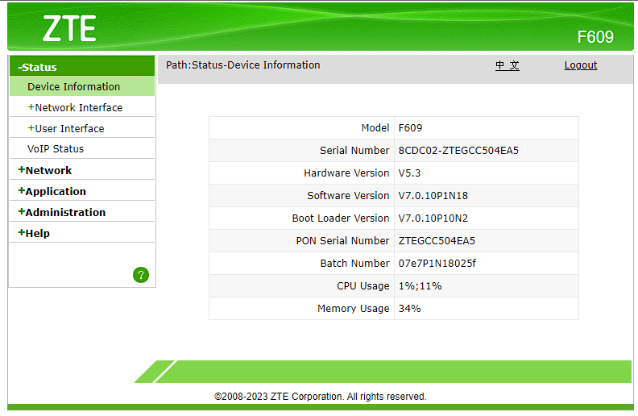
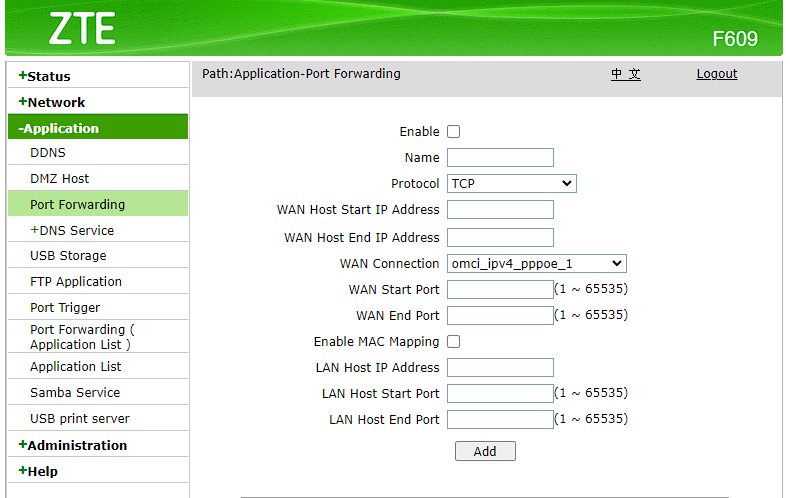
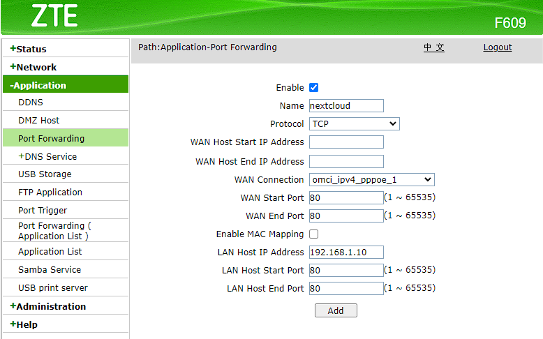
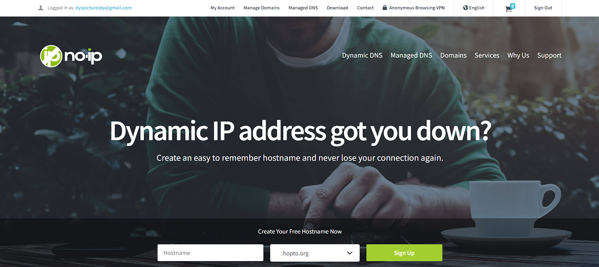
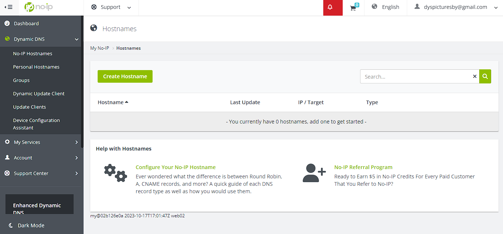
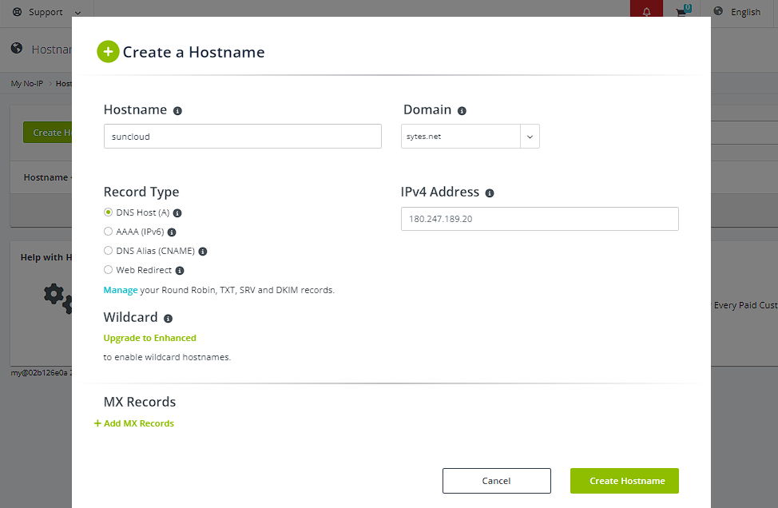
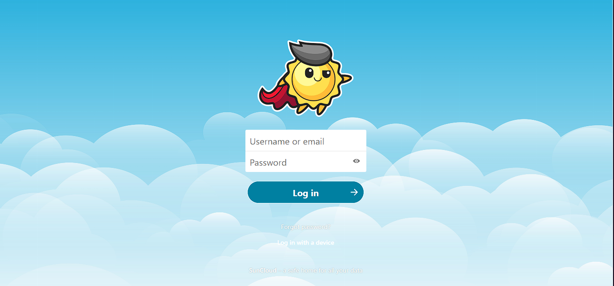
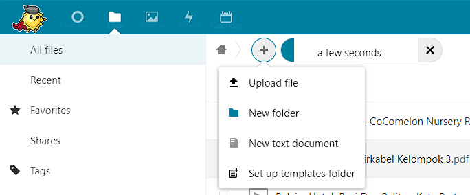
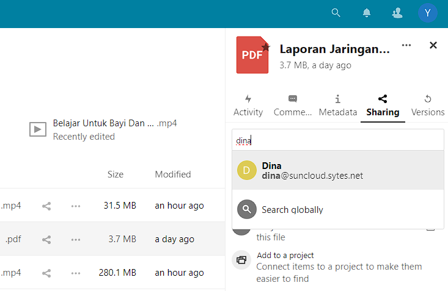

# Suncloud 
<h1 align="center">IMPLEMENTASI PENYIMPANAN AWAN MENGGUNAKAN NEXTCLOUD PADA VIRTUAL MACHINE DI BIDANG PENDIDIKAN</h1>
<h3 align="center"> Suncloud based nextcloud on virtual machine </h3>

## Kelompok 3 :
- Dina Amilia		21050974008
- Arju Kurnia		21050974029
- Awwalia Arofatun 	21050974030
- Yusi Eka Sonia F.	21050974040
- Yoga Putra R.		21050974043

## Deskripsi :
SunCloud merupakan sebuah sistem yang dibuat untuk memberikan layanan penyimpanan bagi siswa maupun guru dalam menunjang kegiatan akademik di sekolah sesuai dengan kebutuhan yang dibutuhkan dimana hanya pengguna mempunyai akun saja yang dapat mengakses, sehingga data-data akan lebih aman.

## Fitur :
- Pengguna dapat menambahkan file ke next cloud
- Pengguna dapat memindahkan file ke next cloud 
- Pengguna dapat menghapus file next cloud 
- Berbagi secara online di internet (melakukan file sharing kepada user lain dan juga dapat sharing melalui tautan)
- Pengguna dapat membuka dokumen secara langsung tanpa mengunduhnya.

## Tools
Sistem ini dibangun menggunakan : 
- Sebuah laptop
- Domain Name Server 
- Laptop Client 
- Mouse 
- Keyboard 
- Lynux operating system (Ubuntu Server) 
- PHP 
- PostgreSQL  
- Next Cloud
- Oracle VM Virtual Box

## Langkah-langkah : 
### Tahap Konfigurasi Penyimpanan Awan
Pada tahapan konfigurasi penyimpanan awan kami menggunakan nextcloud pada linux ubuntu yang dijalankan melalui virtual machine agar sistem penyimpanan bisa diakses melalui jaringan internet atau public.

  #### A. Konfigurasi Router Indihome 
   1. Masuk ke pengaturan router Indihome dengan mengakses alamat IP router melalui browser
      
   2. Selanjutnya masuk ke menu Application kemudian pilih Port Forwarding
      
   3. Selanjutnya centang kolom enable agar port aktif. Kemudian isi kolom Name sesuai dengan kebutuhan, Pada kolom Protocol pilih TCP. Pada WAN Port Start dan WAN Port End isi dengan angka 80. Pada LAN Host IP Address isi dengan alamat IP Server nextcloud, kemudian pada LAN Port Start dan LAN Port End isi dengan angka 80, kemudian klik Add.
      
  #### B. Konfigurasi DNS menggunakan No-IP
   1. Buka situs www.noip.com melalui browser. Kemudian masuk dengan akun yang telah didaftarkan.
      
   2. Pilih menu Dynamic DNS, kemudian pilih No-IP Hostnames. Kemudian klik Create Hostname untuk membuat hostname baru.
      
   3. Isi Hostname dan pilih Domain yang tersedia, disini kami memilih domain sytes.net. Pada IPv4 Address secara otomatis membaca IP Public Jaringan yang kami gunakan, jika sudah klik Create Hostname.
      
   4. Setelah melakukan konfigurasi, sistem penyimpanan awan yang sudah dibuat sekarang dapat diakses di luar jaringan lokal melalui jaringan internet dengan cara mengakses suncloud.sytes.net melalui browser.
      

### Tahap Modifikasi Nextcloud
Pada tahap modifikasi nextcloud dilakukan untuk memenuhi tujuan penyimpanan awan yang diimplementasikan. Adapun beberapa modifikasi yang dilakukan : 
   1. Memberikan kapasitas penyimpanan yang berbeda setiap user.
   2. Merubah tampilan dari nextcloud, dengan tampilan suncloud.
   3. Menambahkan fitur Document viewer.

Setiap user memiliki kapasitas penyimpanan yang berbeda sesuai dengan kebutuhan hanya administrator yang mempunyai kapasitas penyimpanan unlimited atau tidak terbatas. Adapun pembagian kapasitas penyimpanan pada masing-masing user sebagai berikut : 

  | USER | KAPASITAS |
  | ------ | ------ |
  | Admin | Unlimited |
  | Guru | 10 GB |
  | Siswa | 5 GB |

### Tahap Pengujian
Pada tahapan ini akan dilakukan pengujian terhadap aktivitas dalam jaringan sistem penyimpanan menggunakan nextcloud. 
   1. Pada Nextcloud kita dapat membuat user sesuai dengan kebutuhan. Hanya pengguna yang mempunyai akun saja yang dapat mengakses, sehingga data-data akan lebih aman.
      
   2. Setiap user dapat menambahkan, memindahkan, menghapus, mengubah data ke nextcloud.
      
   3. Pengguna juga dapat melakukan file sharing kepada user lain dan juga dapat sharing melalui tautan.
      
   4. Pengguna dapat membuka dokumen secara langsung tanpa mengunduhnya.
      
   5. Pengguna juga dapat memutar media pada nextcloud.
      

## Kesimpulan
Implementasi penyimpanan awan menggunakan Nextcloud pada mesin virtual di bidang pendidikan adalah langkah yang bermanfaat dan relevan. Hal ini memungkinkan akses data yang mudah, kolaborasi yang lebih baik, dan manajemen data yang lebih efisien.   Dengan demikian, teknologi ini memiliki potensi untuk memperkaya pengalaman pendidikan dan memungkinkan lembaga pendidikan untuk mengoptimalkan sumber daya mereka.

### Anda dapat mengunjungi URL Situs ini :
🌐[suncloud.sytes.net](http://suncloud.sytes.net/nextcloud)

##### Sistem ini disusun oleh :
 > Yoga Putra R. 043 | 
 > Arju Kurnia 029 |
 > Dina Amilia	008 |
 > Awwalia Arofatun 030 |
 > Yusi Eka Sonia F. 040
##### 🌐[S1 Pendidikan Teknologi Informasi UNESA](https://pendidikan-ti.ft.unesa.ac.id/)

